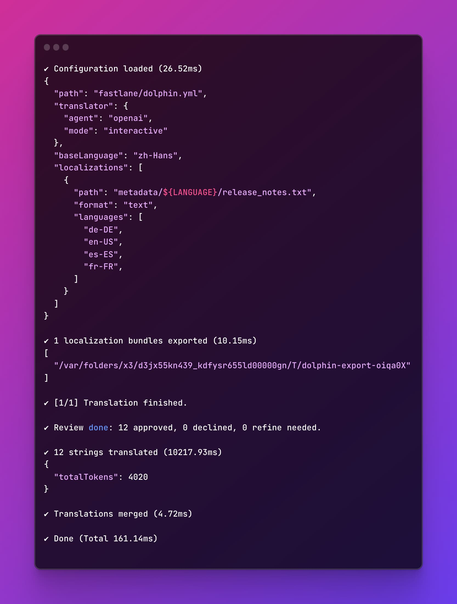

**Dolphin** is an innovative, automated internationalization (i18n) service designed to integrate seamlessly into your development pipeline.

<!--ts-->

- [Installation](#Installation)
- [Usage](#Usage)
- [Configuration](#Configuration)
- [Troubleshooting](#Troubleshooting)

<!--te-->

## How it works?

Dolphin is an automation tool that helps you to localize your app/website strings. It can automatically export, translate and import strings in your projects.

The process is simple to understand:

1. **Export** the strings from your project based on configuration.

2. **Translate** and review the strings to the target languages using the specified translator.

3. **Import** the translated strings back to your project.

## Installation

Install Dolphin globally with npm/pnpm/yarn:

```shell
npm install -g @icodesign/dolphin
```

Check if the installation is successful by running:

```shell
dolphin --version
```

## Usage

Dolphin requires a configuration file to desribe the translation strings and preferred options.

Here's an example of a configuration file:

```yaml
baseLanguage: en
translator:
  agent: openai
  mode: interactive
localizations:
  - id: hostapp
    path: TranditionalXcodeDemo/${LANGUAGE}.lproj/Localizable.strings
    format: strings
    languages:
      - fr
      - ja
      - zh-Hans
```

It means that Dolphin will look for a file named `Localizable.strings` in the `TranditionalXcodeDemo/en.lproj` directory whose format is `Apple Localized Strings`. And then translate it to French, Japanese, and Simplified Chinese with the `api` translator.

For more details on how to write a configuration file, please check the [Configuration](#Configuration) section.

### Translator

Dolphin defines an interface for translators to implement, which is responsible for translating source strings into target languages.

> I'm still working on adding more translators. PRs are welcome!

#### openai

This is a local translator which uses OpenAI API to translate strings. To use this translator, you need to provide the OpenAI API key as an environment variable (`OPENAI_API_KEY`) or pass it to the translator with the `apiKey` option.

#### api

The `api` translator is a built-in translator that uses the Dolphin API (or compatible) service to translate strings. You need to provide the `baseUrl` to the API endpoint.

> Related spec and code of the API service (using Next.js as an example) can be found in the [api folder](https://github.com/icodesign/dolphin/tree/main/apps/api/).
>
> You can deploy the API service to your own server or managed platforms (like Vercel) and change the `baseUrl` to your server address.
>
> Deploy to Vercel with a single click:
>
> [](https://vercel.com/new/clone?repository-url=https%3A%2F%2Fgithub.com%2Ficodesign%2Fdolphin&env=OPENAI_API_KEY&envDescription=The%20openai%20api%20key&envLink=https%3A%2F%2Fplatform.openai.com%2Fapi-keys)

You can also implement your own API server if needed.

### Running Dolphin

By default, Dolphin looks for a file named `dolphin.yml` in the current working directory.

```shell
dolphin localize
```

You can specify a different file with the `--config` option.

```shell
dolphin localize --config path/to/dolphin.yml
```

An interactive shell like below will guide you through the translation process.



## Configuration

Configration file is a YAML file with the following structure:

```yaml
baseLanguage: [required, language code]

translator:
  agent: [required, translator name]
  mode: [required, translator mode]
  .... [extra config for the translator]

globalContext: [optional, custom translation context]

localizations:
  - id: [required, string, to identify the localization]
    path: [required, path to strings]
    format: [required, string format]
    languages:
      - [required, language code]
      - [required, language code]
      ...

  - id: [required, string, to identify the localization]
    path: [required, path to strings]
    format: [required, string format]
    languages:
      - [required, language code]
      - [required, language code]
      ...

  ...
```

Language codes can be any commonly used ones, such as `en-US`, `ja`, `es`, etc. As long as it is supported by the translator.

#### baseLanguage

The source language of the strings, which is used to translate from.

#### translator

Supported translators:

- **openai**: OpenAI API. You need to provide the OpenAI API key as an environment variable (`OPENAI_API_KEY`) or pass it to the translator with the `apiKey` option.
- **api**: Dolphin API. You need to provide the `baseUrl` to the API endpoint.

Supported modes:

- **interactive**: In interactive mode, after strings are translated, Dolphin will ask you to review the result to approve or ask the agent to refine. By default, this mode is not enabled.

#### globalContext

The context of the translation. It will be used to provide more information to the translator.

> For example, if you don't want specific words to skipped, you can say "xxx is a specific term which should be translated."

#### id

Arbitary unique id across localizations, used to identify the specific localization in the project.

#### format

- **text**: Plain text
- **json**: JSON file, usually used in frontend apps
- **xliff**: Xliff file
- **strings**: Apple Localized Strings (with `"key" = "value"` format)
- **xloc**: Xcode Localization Catalog
- **xcode**: Xcode project (Using Xcode built-in localization tool to import/export strings)

#### path

The path to the localization file. You can use `${LANGUAGE}` as the language placeholder.

> For Xcode format, the path should be `.xcodeproj` folder.

#### languages

The target languages to translate to.

## Examples

For more examples, please check the [Examples](https://github.com/icodesign/dolphin/tree/main/examples/) repo.

## Troubleshooting

### Logs

By default, shell wil only show the major output. To see more details, you can check the log file at `~/Library/Logs/Dolphin/dolphin-[date].log`. The log directory will also be printed at the top of the shell output.

### Exported Strings

Dolphin will export the translated strings to the `.dolphin` folder in the same directory of the configuration file. You can check if the exported strings are correct there.
